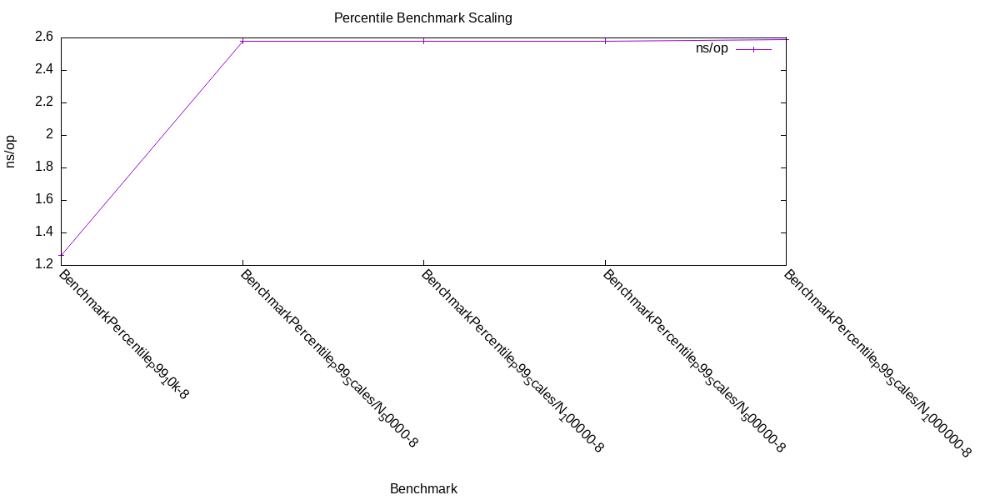
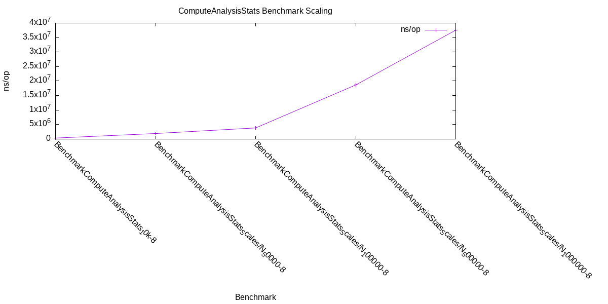

# Stream Aggregation Service

[](https://github.com/AlexisHutin/stream-aggregation-service/actions/workflows/ci-cd.yml) [](https://codecov.io/gh/AlexisHutin/stream-aggregation-service)

## Table of Contents

- [Stream Aggregation Service](#stream-aggregation-service)
  - [Table of Contents](#table-of-contents)
  - [Overview](#overview)
  - [Architecture](#architecture)
  - [Tech Stack](#tech-stack)
  - [Benchmarks](#benchmarks)
    - [Percentile benchmarks](#percentile-benchmarks)
    - [ComputeAnalysisStats benchmarks](#computeanalysisstats-benchmarks)
  - [Known Trade-offs](#known-trade-offs)
  - [Prerequisites](#prerequisites)
  - [Configuration](#configuration)
  - [Run Locally](#run-locally)
  - [Run with Docker](#run-with-docker)
  - [Testing](#testing)
  - [Useful Make Targets](#useful-make-targets)
  - [Possible Improvements](#possible-improvements)

## Overview

Stream Aggregation Service is a Go HTTP API that consumes a live SSE (Server-Sent Events) stream of social-like posts and computes statistics over a requested time window.

Main endpoint:

`GET /analysis?duration=<duration>&dimension=<metric>`

Example:

`GET /analysis?duration=5s&dimension=comments`

The response includes:

- total posts received during the window
- minimum and maximum timestamps
- P50, P90, and P99 for the requested metric

Example output (`GET /analysis?duration=5s&dimension=comments`):

```json
{
   "total_posts": 128,
   "minimum_timestamp": 1713405601,
   "maximum_timestamp": 1713405606,
   "comments_p50": 12,
   "comments_p90": 41,
   "comments_p99": 93
}
```

Supported dimensions:

- `likes`
- `comments`
- `retweets`
- `favorites`

Duration examples:

- `5s` (5 seconds)
- `30s` (30 seconds)
- `2m` (2 minutes)
- `1h` (1 hour)

Example requests:

- `GET /analysis?duration=30s&dimension=likes`
- `GET /analysis?duration=2m&dimension=retweets`

Health endpoint:

`GET /ping`

## Architecture

```ascii
.
├── controllers/        # HTTP handlers (validation + response)
├── services/           # Business logic (SSE collection + aggregation)
├── config/             # Configuration loading
├── types/              # Shared types
├── tests/              # Integration tests (Venom)
└── main.go             # Entry point
```

Request flow:

1. The HTTP controller parses and validates `duration` and `dimension`.
2. The service opens an SSE stream and collects events during the window.
3. Event payloads are decoded and projected to the selected metric.
4. Values are sorted and nearest-rank percentiles are computed.
5. The API returns a JSON response.

## Tech Stack

- Go + Gin for the HTTP API
- SSE for streaming input
- Layered structure for maintainability
- Table-driven unit tests + Venom integration tests

## Benchmarks

Run benchmarks and regenerate benchmark tables/charts in the README:

```bash
make benchmark
```

This command:

- runs Go benchmarks with memory metrics (`ns/op`, `B/op`, `allocs/op`)
- writes raw output to `./build/bench.txt`
- renders split benchmark artifacts via `scripts/bench-render.sh`
- updates the README block between `<!-- BENCHMARKS START -->` and `<!-- BENCHMARKS END -->`

<!-- BENCHMARKS START -->
### Percentile benchmarks

| Benchmark | ns/op | B/op | allocs |
|----------|------:|-----:|-------:|
| BenchmarkPercentile_P99_10k-8 | 1.264 | 0 | 0 |
| BenchmarkPercentile_P99_Scales/N_50000-8 | 2.579 | 0 | 0 |
| BenchmarkPercentile_P99_Scales/N_100000-8 | 2.579 | 0 | 0 |
| BenchmarkPercentile_P99_Scales/N_500000-8 | 2.579 | 0 | 0 |
| BenchmarkPercentile_P99_Scales/N_1000000-8 | 2.588 | 0 | 0 |



### ComputeAnalysisStats benchmarks

| Benchmark | ns/op | B/op | allocs |
|----------|------:|-----:|-------:|
| BenchmarkComputeAnalysisStats_10k-8 | 428760 | 81922 | 1 |
| BenchmarkComputeAnalysisStats_Scales/N_50000-8 | 1927600 | 401408 | 1 |
| BenchmarkComputeAnalysisStats_Scales/N_100000-8 | 3859886 | 802816 | 1 |
| BenchmarkComputeAnalysisStats_Scales/N_500000-8 | 18673494 | 4005889 | 1 |
| BenchmarkComputeAnalysisStats_Scales/N_1000000-8 | 37621573 | 8003584 | 1 |



<!-- BENCHMARKS END -->

## Known Trade-offs

- In-memory collection of window events
- Exact percentile computation currently relies on full sorting, which increases CPU cost and response latency on large windows, and requires keeping all metric values in memory.
- New SSE connection per analysis request
- No cache/shared stream fan-out yet

## Prerequisites

- Go (version compatible with `go.mod`)
- Docker (for integration dependencies)
- `curl` (used by `make integration-dependencies` to install Venom if missing)
- `gnuplot` (required by `make benchmark` to render benchmark charts)

## Configuration

`CONFIG_FILE` is required at runtime.

Example `config.json`:

```json
{
   "stream": {
      "url": "http://your-sse-server/stream"
   }
}
```

Environment variables:

- `CONFIG_FILE` (required)
- `PORT` (optional, defaults to `8080`)

The repository includes examples:

- `.env.exemple`
- `config.json.exemple`

## Run Locally

```bash
go mod download
make build
CONFIG_FILE=./config.json PORT=8080 ./build/stream-aggregation-service
```

Development mode with reflex:

```bash
make run
```

`make run` loads variables from `.env` when that file exists.

## Run with Docker

```bash
docker build -t stream-aggregation-service:latest .
docker run --env-file .env \
   -v "$(pwd)/config.json:/config.json:ro" \
   -p 8080:8080 \
   stream-aggregation-service:latest
```

## Testing

Unit tests:

```bash
go test ./...
```

Integration prerequisites (installs Venom if needed and (re)starts `smocker`):

```bash
make integration-dependencies
```

Run integration tests:

```bash
make integration
```

One-shot CI-like flow (build -> integration-dependencies -> run binary -> integration):

```bash
make ci
```

`make ci` loads variables from `.env.test` when that file exists.

## Useful Make Targets

- `make build`: compile the service binary to `./build/stream-aggregation-service`
- `make run`: start development mode with `reflex` (auto-reload) and load `.env` if present
- `make test`: run all Go tests with a coverage profile output in `./build/coverage.txt`
- `make benchmark`: run benchmarks and regenerate benchmark tables/charts in the README
- `make integration-dependencies`: install Venom if missing and (re)start the `smocker` container
- `make integration`: run Venom integration test suites under `tests/venom`
- `make ci`: run the full local CI flow (build -> integration dependencies -> start service -> integration)
- `make clean`: remove `smocker` and clean files in `./build`

## Possible Improvements

- Streaming percentile approximation (instead of full sorting)
- Shared SSE consumption across requests
- Better network resilience/retry strategy
- Caching and richer observability
- Helm chart for Kubernetes deployment (enables scaling, resource management, etc.)
